# HAM · Horas Al Mando

**Tu bitácora de vuelo, radar y competencias — todo en una app.**

Aplicación Android para pilotos que registra tus vuelos con GPS en tiempo real, te muestra a otros pilotos en el aire y te permite competir en circuitos aéreos.

---

## Descripción para Google Play

### Título
Horas Al Mando — Bitácora y Radar de Vuelo

### Descripción corta
Registrá tus vuelos, competí en circuitos y volá junto a otros pilotos.

### Descripción completa

**Horas Al Mando (HAM)** es la app pensada para pilotos que quieren registrar cada vuelo, mejorar su técnica y compartir el cielo con la comunidad.

Iniciá un vuelo y HAM registra automáticamente tu recorrido con datos precisos en tiempo real: **altitud, velocidad, rumbo y tiempo de vuelo**. Al finalizar, todo queda guardado en tu bitácora personal.

**✈️ Registrá tus vuelos**
- Seguimiento GPS en tiempo real con altitud, velocidad y rumbo.
- Instrumentos claros en pantalla mientras volás.
- El seguimiento continúa en segundo plano, incluso con la pantalla apagada.
- Sincronización automática con tu cuenta al terminar el vuelo.

**🗺️ Historial y repetición**
- Todos tus vuelos guardados en tu bitácora.
- Reproducí cualquier vuelo sobre el mapa para revisar tu recorrido.
- Sumá tus horas al mando de forma automática.

**👻 Modo Fantasma**
- Competí contra tu propio récord personal.
- Un "fantasma" recorre tu mejor marca mientras volás para que intentes superarte.

**🏁 Circuitos aéreos**
- Creá circuitos con waypoints marcados sobre el mapa.
- Recorré circuitos de la comunidad y registrá tu tiempo.
- Rankings y tiempos por circuito para competir con otros pilotos.

**📡 Radar social**
- Mirá en tiempo real a otros pilotos que están volando cerca.
- Posición, altitud y velocidad de cada piloto en el mapa.

**👤 Tu perfil de piloto**
- Horas totales de vuelo, licencia y datos de tu cuenta.
- Registro con verificación por email.

Ideal para pilotos de aviación general, deportiva y recreativa que quieren llevar su bitácora digital, mejorar su performance y volar acompañados.

> **Nota:** HAM usa el GPS en segundo plano para registrar tu recorrido de vuelo aún con la app minimizada o la pantalla apagada. La ubicación solo se registra durante un vuelo activo.

---

## 📸 Capturas de pantalla

| Login / Registro | Vuelo en curso | Instrumentos |
|:---:|:---:|:---:|
| 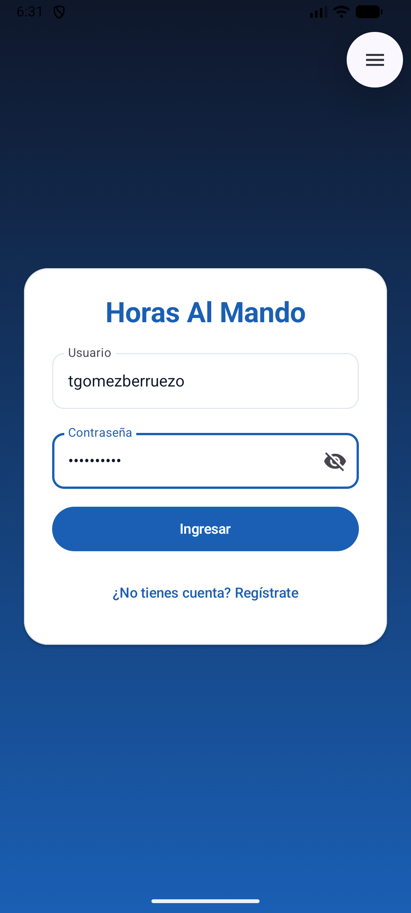 | 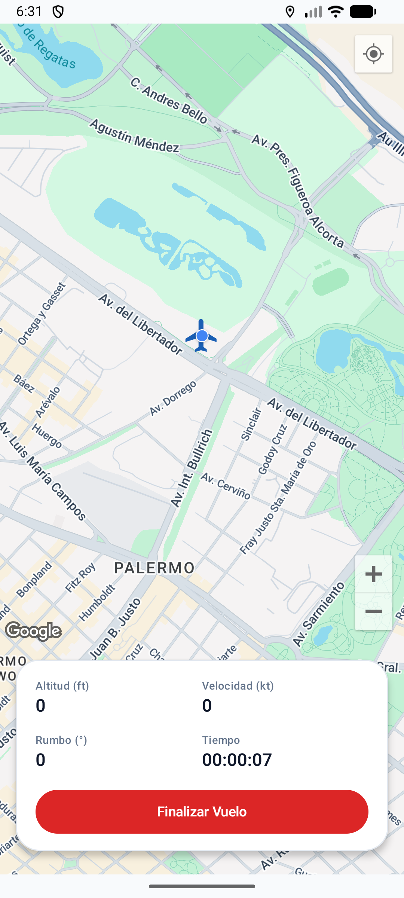 | 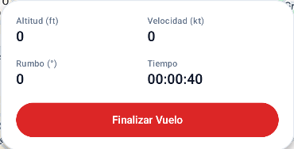 |

| Historial de vuelos | Repetición de vuelo | Modo Fantasma |
|:---:|:---:|:---:|
| 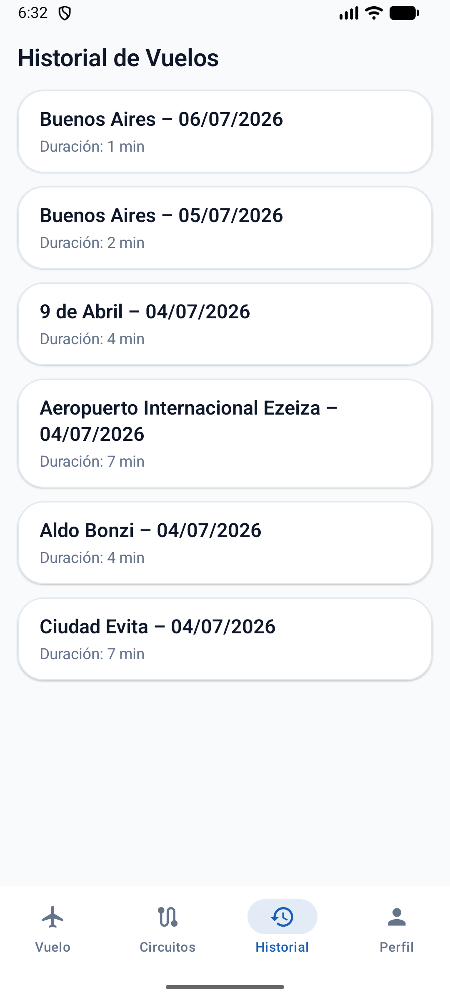 | 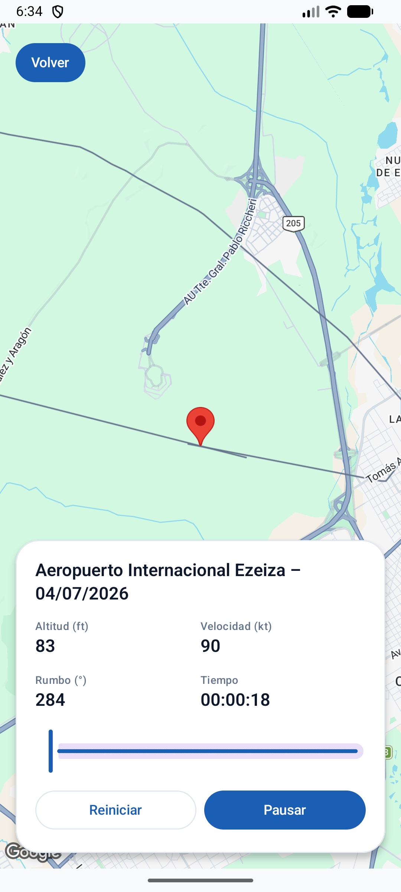 | 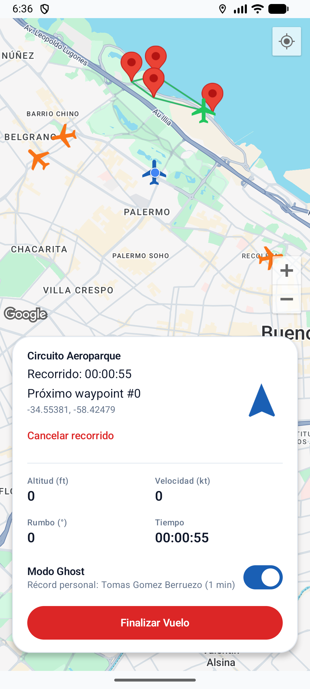 |

| Circuitos aéreos | Detalle de circuito | Crear circuito |
|:---:|:---:|:---:|
| 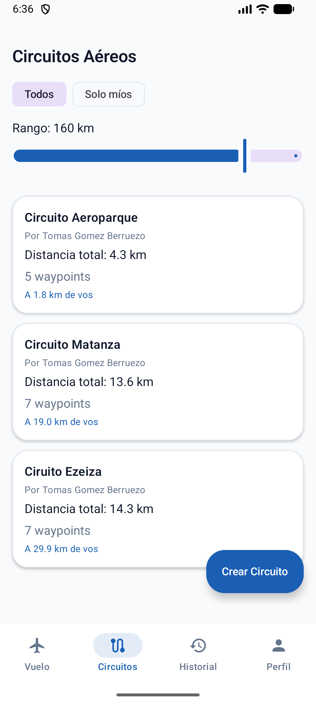 | 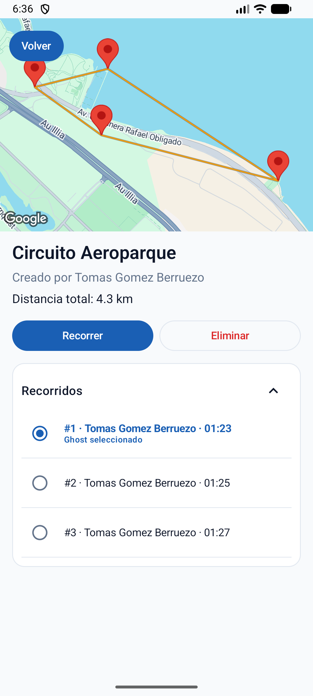 | 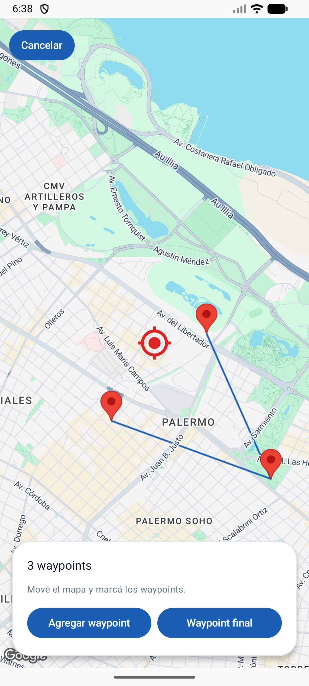 |

| Radar social | Perfil de piloto |
|:---:|:---:|
| 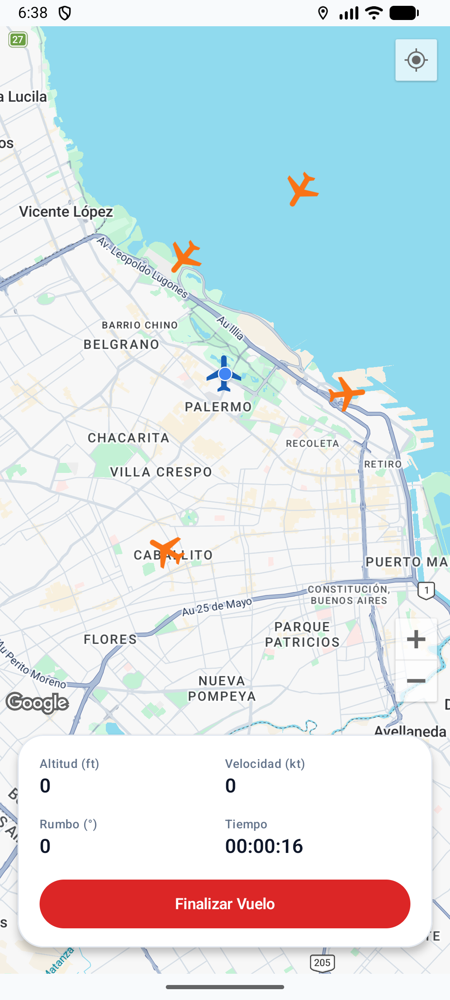 | 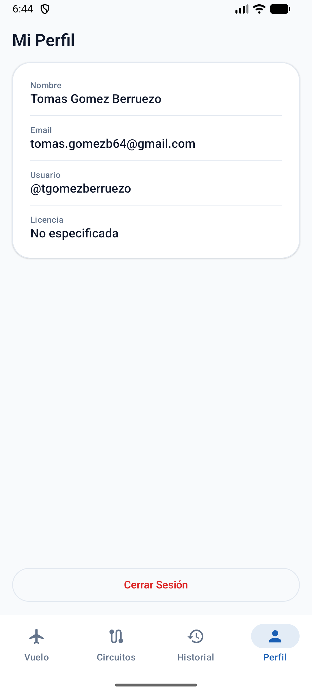 |

---

## 🛠️ Sobre el proyecto (técnico)

App Android nativa desarrollada en **Kotlin + Jetpack Compose**.

- **UI:** Jetpack Compose + Material 3, navegación con Navigation Compose.
- **Mapas:** Google Maps Compose (`play-services-maps`, `play-services-location`).
- **Tiempo real:** WebSockets para el radar social y la sincronización de vuelos.
- **Sensores/Hardware:** GPS, brújula y sensores del dispositivo para altitud, velocidad y rumbo.
- **Seguimiento en segundo plano:** `FlightTrackingService` (foreground service de tipo `location`).
- **Backend:** consume la API de [**ham-core-api**](../ham-core-api) para autenticación, vuelos, circuitos y radar.
- **minSdk:** 26 · **targetSdk:** 35

### Configuración local

Definí en `local.properties` (no versionado):

```properties
MAPS_API_KEY=tu_api_key_de_google_maps
API_BASE_URL=https://api.horasalmando.com.ar/api/v1/
WS_BASE_URL=wss://api.horasalmando.com.ar/api
```

### Compilar

```bash
./gradlew assembleDebug     # APK de debug
./gradlew assembleRelease   # build de release para la tienda
```

## Licencia

Ver [LICENSE](LICENSE).
